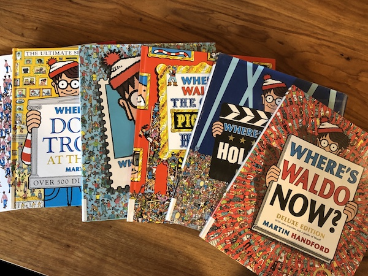
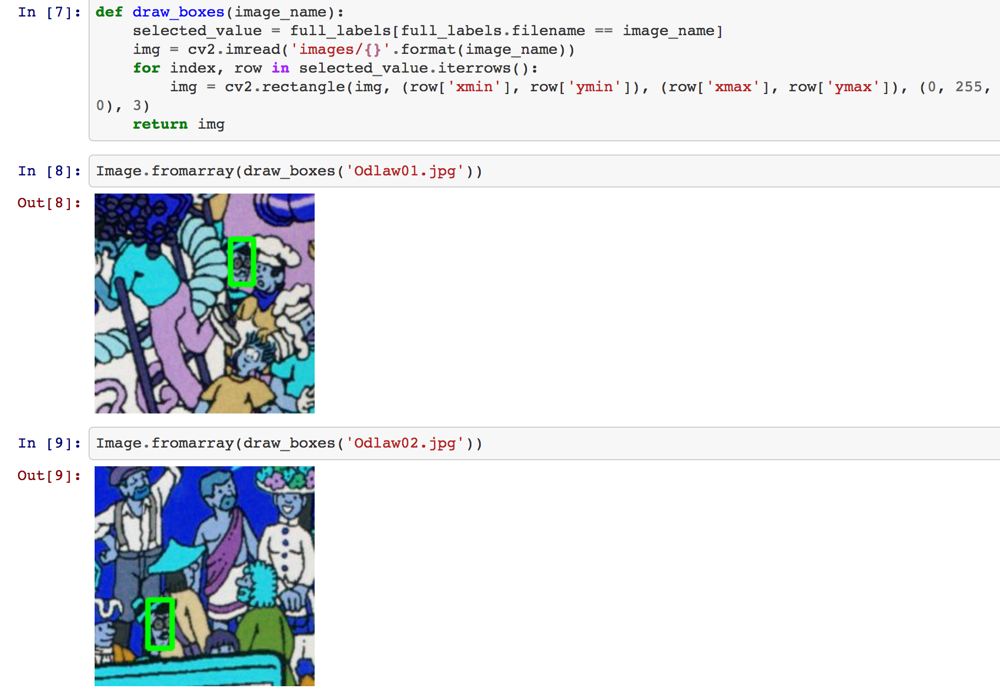

 <b> Machine-Learning-Project</b>

  

#### **Project Team:** Jorge A. Cavazos, Cynthia Juarez, Lynn Leifker, and Kellye Rennell

#### **Problem:** How can we effectively find Waldo and his friends Wenda, Whitebeard, and Odlaw in the Where’s Waldo series of pictures?

**In the Beginning**

We thought it would be fun to create a machine learning model that would allow a user to upload a picture of a Where’s Waldo scene and have it automatically locate Waldo and his friends. Some internet searching found us a couple of articles about people using machine learning to find Waldo. [Randy Olson](http://www.randalolson.com/2015/02/03/heres-waldo-computing-the-optimal-search-strategy-for-finding-waldo/) computed the optimal path for finding Waldo using a genetic algorithm. Key takeaway: start your search for Waldo in the bottom left quadrant of a page. This didn't actually give us Waldo’s location for any given image, but it was helpful when it came time to do a manual search.

On GitHub we found one convolutional neural network trained on [19 Waldo images](https://github.com/vc1492a/Hey-Waldo). Various people have built [their own apps](https://github.com/tadejmagajna/HereIsWally) using this model, but its accuracy is only about 50 percent. [Tadej Magajna](https://github.com/tadejmagajna/HereIsWally) had the best-looking app; the fadeaway behind Waldo really helps him stand out.

**He Can Hide with a Little Help from his Friends**

We decided to use TensorFlow’s Object Detection API, specifically the [faster-rcnn-inception-v2-coco](faster-rcnn-inception-v2-coco) model, on which the other Waldo model was based. The base model has been trained on roughly 300,000 images and we thought it would be relatively quick to train.

To prepare the images, we used a Python script to resize the images so that they would be consistent for training. We then needed to create bounding boxes for each character’s head so that the training would be focused on their faces and hats. To get the needed x and y values of these boxes, we used the [LabelImg](https://github.com/tzutalin/labelImg) graphical annotation tool. We followed [Tanner Gilbert’s tutorial](https://github.com/TannerGilbert/Tutorials/tree/master/Tensorflow%20Object%20Detection) to convert this data to csv so that we could add image categories (the names of characters) for each. After this we used another Python script to split the photos into training and testing groups and yet another to put the images into .tfrecord format so that the TensorFlow model could read them. We then created a label map so that they would be correctly annotated as they ran through training and testing.

To check that everything had gone smoothly, we used a modified [Python script](https://github.com/datitran/raccoon_dataset) to render the images within the .tfrecord file. We noticed that the images had acquired a blue cast. We looked for bugs in the various scripts we had run but were unable to find any, so we moved on to the next step and kept our fingers crossed that training would work anyway.

Next we cloned the TensorFlow model repo and installed the Object Detection API. Running it required configuring the pipeline for the photos to be trained. 

***

https://github.com/Jcavazosg/ML_Facial_Rec

Because of the difficulty in getting this model trained, we researched facial recognition models to see if they might be more effective in locating Waldo. The ones we tested turned out not to be able to recognize the drawings as faces. However, they were very good at recognizing human faces in real time. For each of our classmates, we downloaded one photo from Slack or LinkedIn. With this single photo for training and some quick labeling, we made a surprisingly accurate model!
