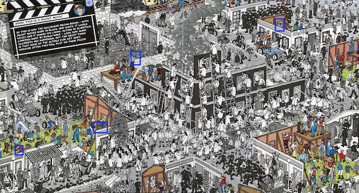

<h1> Machine Learning Project</h1>

  

**Project Team:** Jorge A. Cavazos, Cynthia Juarez, Lynn Leifker, and Kellye Rennell

**Problem:** How can we effectively find Waldo and his friends Wenda, Whitebeard, and Odlaw in the *Where’s Waldo* series of pictures?

---

## In the Beginning ##

We thought it would be fun to create a machine learning model that would allow a user to upload a picture of a *Where’s Waldo* scene and have it automatically locate Waldo and his friends. Some internet searching found us a couple of articles about people using machine learning to find Waldo. [Randy Olson](http://www.randalolson.com/2015/02/03/heres-waldo-computing-the-optimal-search-strategy-for-finding-waldo/) computed the optimal path for finding Waldo using a genetic algorithm. Key takeaway: start your search for Waldo in the bottom left quadrant of a page. This didn't actually give us Waldo’s location for any given image, but it was helpful when it came time to do a manual search.

On GitHub we found one convolutional neural network trained on [19 Waldo images](https://github.com/vc1492a/Hey-Waldo). Various people have built their own apps using this model, but its accuracy is only about 50 percent. [Tadej Magajna](https://github.com/tadejmagajna/HereIsWally) had the best-looking app; the fadeaway behind Waldo really helps him stand out.

## He Can Hide with a Little Help from His Friends ##

We didn’t find any models trained for Waldo’s friends, so we knew we would need to do some training ourselves to find them. This would require a set of training and testing images.

Getting these images took a little legwork. We borrowed six *Where’s Waldo* books from the Austin Public Library and scanned in 68 total scenes. 

Unfortunately, we were unable to find an answer key in the books or online. Christmas break was the ideal time to do the hard work of locating Waldo and his friends manually, especially with kids home from school who could be persuaded to help. Randy Olson’s search strategy helped us find Waldo, but locating Wenda, Whitebeard, and Odlaw took a significant amount of time. We created our own answer key for each scene to provide a reference when it was time to create the training images.

From the scans, we pulled out roughly 40 headshots of each of the four characters for training and testing. We wanted the clearest pictures of each character, and we thought that doubling the number of trained images from the previous high of 19 would provide a solid enough foundation to do some accurate searching.

## Finding the Right Model ##

Before finalizing the images for training, we did some research on what type of model would be best. It quickly became apparent that a convolutional neural network is the ideal machine learning model for image recognition. The performance of the best CNNs on object identification can have a classification error rate of 0.06 percent, [which is close to humans’ performance in recognizing the same images](https://en.wikipedia.org/wiki/Convolutional_neural_network#Image_recognition).

We decided to use [TensorFlow’s Object Detection API](https://tensorflow-object-detection-api-tutorial.readthedocs.io/en/latest/index.html"), specifically the [faster-rcnn-inception-v2-coco](https://github.com/tensorflow/models/blob/master/research/object_detection/samples/configs/faster_rcnn_inception_v2_coco.config) model, on which the other Waldo model was based. The base model has been trained on roughly 300,000 images and we thought it would be relatively quick to train. Without a model pre-trained on hundreds of thousands of labeled images, we would be looking at weeks or longer to train a CNN from start to finish.

## Image Preparation ##

To prepare the images, we first used a Python script to resize the images so that they would be consistent for training. We then needed to isolate the characters from the rest of the image. To do this, we downloaded the [LabelImg](https://github.com/tzutalin/labelImg) graphical annotation tool to create bounding boxes for each character’s head so that the training would be focused on their faces and hats. This software provides the x and y coordinates of the bounding boxes, which otherwise would have to be found by hand.

A very important part of preparing the images was to get them into a form TensorFlow could read. LabelImg outputs the images to `.xml` files. We had to use a Python script to convert these files to `.csv` so that they could have categories (character names) attached to each image. From `.csv`, they needed to be transferred into the `tf.record` format so that they could be inputted into the learning pipeline, and this required more research in order to locate an appropriate script. 

## Choosing an Operating System for Training the Model ##

Pretty much everything in machine learning can be controlled using Python, but unfortunately, LabelImg is only available for the Windows operating system. We weren't going to pass up using this tool. Half of our team are Windows users and half are Macs. This was the point where we decided to divide our efforts. Our Windows team had already done significant research in finding online tutorials to get the model up and running and these tutorials were set up for Windows users. We decided to have the Windows team work on training the model and to have the Mac team work on preparing the presentation and on making a backup plan just in case we couldn’t get the model to work. (Spoiler alert: it did!)

## Learning to Train ##

Among many other people, [Gilbert Tanner](https://github.com/TannerGilbert/Tutorials/tree/master/Tensorflow%20Object%20Detection) provided useful tutorials on how to train the TensorFlow Object Detection API. Even with his helpful GitHub repos and YouTube videos, even with the help of other tutorials and the TensorFlow Object Detection API documentation, and even with a last-ditch decision to resort to textbooks, getting the model trained and running proved to be a difficult and laborious task.

## TensorFlow 2.0 ##

One of our primary problems was TensorFlow’s recent rollout of version 2.0, a new version that isn’t backwards-compatible with their previous versions. Among many other strange choices in the update was the decision to deprecate primary commands like `app.run`, which is confusingly renamed `combat.v1.app.run`. Unfortunately for us, the official Object Detection API models use this earlier code—and to our knowledge TensorFlow has not created documentation to explain the change in command names. It took a good while to track down these name-change bugs. We’re not alone, either; others have been mystified by the same changes.

Downloading and installing old versions of TensorFlow solved some of our problems. Other problem arose, however, in each step of preparing and training the data. Different tutorials with helpful code used different, incompatible (with each other), versions of TensorFlow. The solution was to create multiple environments with different versions of TensorFlow installed. Moreover, different Python scripts sometimes had incompatible dependencies. One important image library, PIL, replaced Pillow, an earlier image library, and the two can’t be installed in the same environment. This meant more time spent debugging problems with various Python scripts that used one library or the other. 

Kellye and Cynthia spent hours tracking down problems.

## Checking Our Images Before Training ##

Since finding a workable script to view the `tf.record` files proved to be difficult, we decided to see how the `.xml` output looked after using the LabelImg tool. 

To check that everything had gone smoothly, we used a modified version of [Dat Tran’s Python script from his raccoon dataset](https://github.com/datitran/raccoon_dataset) to render the images. After running the Jupyter Notebook, we noticed that the images had acquired a blue cast. We looked for bugs in the various scripts we had run but were unable to find any, so we moved on to the next step and kept our fingers crossed that the training would work anyway.

We then split the images into training and testing sets with an 80-20 ratio.

The last step in image preparation was to create a label map file for the character names and to run a Python script to combine the label map with the `.csv` to create the `tf.record` file.

## The Training Begins ##

The next step was to configure the Object Detection API pipeline to send the images through training. Among other challenges was the need to create a completely new directory structure that would be compatible with the code.

Now we needed to decide whether to run a CPU model or a GPU model that would require many additional dependencies. The CPU was native to our older Windows machines but the GPU could be run in the Google Cloud. The Cloud computer, however, requires active supervision, as it times out after 30 minutes of training. Our Windows users made the decision to run the training locally even though CPU training is slower. The advantage was that the computer could be left alone to do its work for hours or even overnight. 

## Output ##

The initial output was pretty encouraging. While the loss rate was pretty high, it was much, much lower than it would have been without a pre-trained model.

Within a few hours, the loss rate had dropped to half of a percent.

## Meanwhile... ##

Jorge and Lynn buckled down on finding alternate methods for finding Waldo. Using a facial recognition algorithm seemed like a promising idea. It turns out that this technology is much more advanced than object recognition, so much so that the Python library [OpenCV](https://opencv.org/) can be used with only a single Python script and no training at all. It is a very large library with many dependencies, but once it’s installed, it works great. It has more than 2,500 optimized algorithms and has been trained to detect faces and human actions, among other things. Incredibly, it can be trained to detect a particular person’s face from a single image!

It turned out, however, not to work on the scanned two-dimensional Waldo pictures, which was disappointing.

It was actually possible to get the full-face image of Waldo to be identified, but it required bending a printed-out picture a little bit to give it a more 3-D effect, and it didn’t work at all on the scanned scenes.  

It worked great on Jorge, though!

## Back to Our Model ##

Inference graphs are used to perform object detection based on your results. The loss graphs we saw on our TensorBoard were a little confusing, as we didn’t see the expected downward curve, but we remained optimistic.

Once the model was trained, we ran a Python script on the test images that produced a box around the image and identified the character.

It did pretty well on the test images.

On our larger images, the model was sometimes able to find a character, but it didn’t box all four as we expected. Instead, it stopped after finding the first character and then zoomed in on the image, making it difficult to tell where exactly in the scene Waldo or his friends are. This behavior could probably be solved with more research and scripting.

Training proved to be difficult but rewarding. If we were to continue with modeling these images, it might be useful to see if there’s a pre-trained model that’s set up for 2-D graphical images like prints or artwork. If so, we might get a more accurate result.

## Afterword ##

Because running the Waldo model live is difficult, here's a peek at the alternate project.

[Facial Recognition Repo](https://github.com/Jcavazosg/ML_Facial_Rec)
